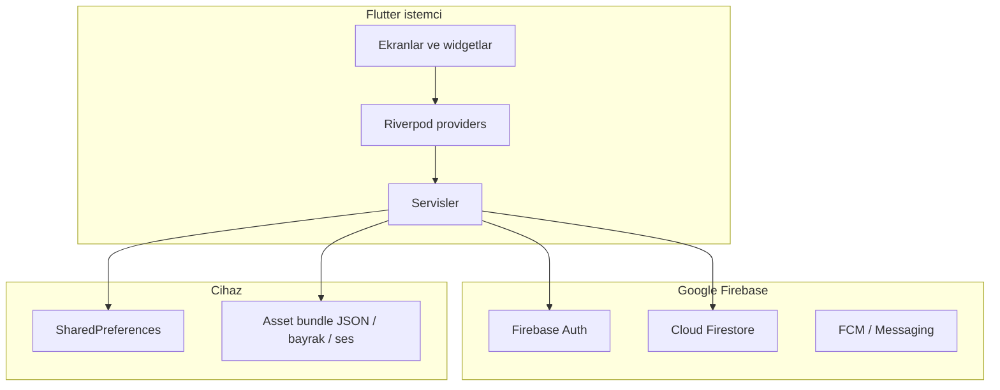
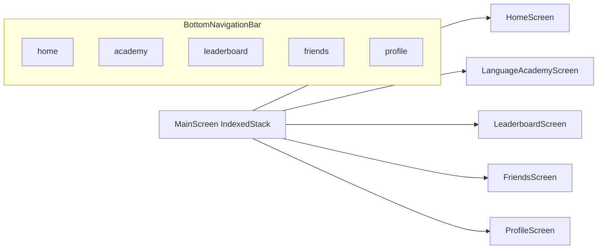
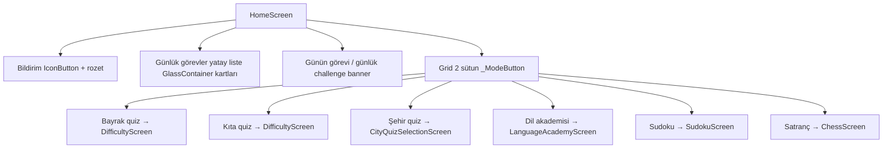

# 🌟 WorldIQ (`world_iq`)

[](https://flutter.dev)
[](https://firebase.google.com)

**WorldIQ**, zeka oyunlarını, coğrafi bilgiyi, dil öğrenimini ve sosyal etkileşimi tek bir çatı altında birleştiren, modern tasarıma sahip premium bir mobil eğitim ve oyun platformudur. Cihaz içi yerel yetenekleri ve bulut senkronizasyonunu destekleyen esnek bir mimariye sahiptir.

---

## 🎯 Proje Hakkında Genel Bakış

WorldIQ, kullanıcıların zihinsel becerilerini geliştirirken aynı zamanda küresel bilgilerini test etmelerini ve dil öğrenmelerini amaçlar. Uygulama, her kesimden kullanıcıya hitap edecek şekilde geniş bir oyun ve eğitim yelpazesi sunar:

*   **🌍 Coğrafya Akademisi & Quizler:** Dünya ülkeleri, bayrakları, kıtaları ve başkentleri üzerine kapsamlı çoktan seçmeli bilgi yarışmaları (Kolay, Orta, Zor seviyelerde).
*   **🗺️ Türkiye Şehirleri & Plaka Oyunu:** Türkiye coğrafyasına özel olarak geliştirilmiş, plaka kodları, coğrafi bölgeler ve şehir eşleştirme modları.
*   **📚 Dil Akademisi (Kelime & Test):** CEFR standartlarına (A1, A2, B1, B2, C1, C2) uygun 10.000'den fazla kelime barındıran akıllı bir dil öğrenme modülü. Flashcard (kart çalışması), kelime ekleme (Kişisel Sözlük), kelime testleri ve SRS (Aralıklı Tekrar) algoritması ile zenginleştirilmiştir.
*   **🧩 Sudoku & Zeka Oyunları:** Farklı zorluk derecelerine sahip, ipuçları ve istatistiklerle donatılmış gelişmiş Sudoku modülü.
*   **♟️ Satranç (Online & Solo):** Firestore tabanlı gerçek zamanlı multiplayer (çok oyunculu) ve solo satranç oynama imkanı.
*   **🏆 Sosyal & Rekabetçi Sistemler:** Canlı liderlik tabloları (Haftalık Ligler), arkadaşlık sistemi, anlık mesajlaşma/bildirimler, oyuncu profilleri ve kazanılan başarıları (Rozetleri) sergileyen başarı tablosu.

---

## 🛠️ Teknolojik Altyapı (Tech Stack)

### Mobil İstemci (Frontend)
*   **Framework:** Flutter (Dart) - Hızlı, yerel ve akıcı bir çoklu platform deneyimi.
*   **Durum Yönetimi (State Management):** Flutter Riverpod - Güvenilir, test edilebilir ve reaktif veri akışı.
*   **Arayüz Tasarımı (UI):** Vanilla CSS/Flutter Tasarım Sistemi, Glassmorphism (Cam efekti) kartlar ve yumuşak geçişli Gradiyent arka planlar ile modern, premium görsel tasarım.
*   **Veri Depolama (Yerel):** SharedPreferences - Dil tercihleri, yerel kelime ilerlemeleri ve ayarların hızlıca saklanması.
*   **Bildirimler & Gerçek Zamanlılık:** Firebase Cloud Messaging (FCM) & Local Notifications.

### Bulut Altyapısı & Gerçek Zamanlı Servisler (Backend)
*   **Firebase Authentication:** UID tabanlı güvenli kullanıcı kaydı, girişi ve oturum kontrolü.
*   **Cloud Firestore:** Gerçek zamanlı multiplayer satranç, arkadaşlık istekleri, presence (çevrimiçi durumu), liderlik sıralamaları ve anlık sosyal akışlar.

### 🔌 Entegre Edilen Harici API'ler (External APIs)
Uygulamanın **Sözlük Arama** ve **Dil Akademisi** modüllerinde dinamik veri doğrulaması, sesli telaffuz ve çeviri sağlamak için iki ayrı küresel REST API entegre edilmiştir:
1.  **Free Dictionary API (`api.dictionaryapi.dev`):** İngilizce kelimelerin fonetik yazılışlarını, kelime türlerini (noun, verb, vb.), İngilizce tanımlarını, örnek cümlelerini ve orijinal **sesli telaffuz (audio pronunciations)** dosyalarını çekmek için kullanılır.
2.  **MyMemory Translation API (`api.mymemory.translated.net`):** Sözlükte aranan veya çalışılan İngilizce kelimeleri dinamik olarak **Türkçeye çevirmek** amacıyla entegre edilmiştir.

---

## 1. Yüksek seviye mimari



**Veri akışı özeti**

| Veri | Ana konum | Not |
|------|-----------|-----|
| Oturum | Firebase Auth | UID tüm sistemde anahtar |
| Sosyal bildirim, çevrimiçi, arkadaşlık yansıması | Firestore | Liderlik tablosu, varlık takibi ve arkadaşlıklar |
| Kelime bankası (A1–C2) | `assets/data/vocabulary.json` + `loadVocabularyData()` | Uygulama içi asset paketi |
| Kelime ilerlemesi (SRS vb.) | SharedPreferences (`SharedPrefsService`) | Cihaz yerel deposu |
| XP / seviye / lig | Firestore | Bulut üzerinde tutulan istatistikler |
| Çok dillilik | `assets/l10n/*.arb` → `lib/l10n/generated` + `l10n_extension.dart` | |

---

## 2. Depo yapısı (özet)

```
lib/
  main.dart                 # ProviderScope, MaterialApp, AuthGate
  firebase_options.dart
  screens/                  # Tüm tam ekranlar (aşağıda envanter)
  widgets/                  # gradient_scaffold, glass_container
  providers/                # Riverpod
  services/                 # Firebase, HTTP, bildirim, ses
  data/                     # countries, turkey_cities, vocabulary loader
  models/                   # DTO / domain modelleri
  l10n/generated/           # flutter gen-l10n çıktısı
assets/
  l10n/                     # app_en.arb, app_tr.arb, ...
  data/, flags/, sounds/, vocabulary/
```

---

---

## 3. Uygulama akış diyagramları

### 3.1. Açılış ve oturum

```mermaid
sequenceDiagram
  participant M as main()
  participant F as Firebase.initializeApp
  participant P as SharedPreferences
  participant V as loadVocabularyData
  participant A as WorldIQApp
  participant G as AuthGate
  participant Auth as FirebaseAuth

  M->>F: init
  M->>P: prefs instance
  M->>V: kelime JSON bundle
  M->>A: runApp ProviderScope
  A->>G: home
  G->>Auth: authStateChanges stream
  alt kullanıcı yok veya anonim
    G-->>LoginScreen
  else kullanıcı var
    G-->>MainScreen
  end
```

### 3.2. Ana sekme (bottom bar)



Dil değişince sekmeler `locale` ile `ValueKey` alır; `AuthGate` `localeProvider` dinler.

### 3.3. Ana sayfa oyun modu kartları



---

## 4. Ekran envanteri (sayfa → ana aksiyon)

| Ekran | Dosya | Kısa açıklama |
|-------|--------|----------------|
| Giriş | `login_screen.dart` | E-posta/şifre tabanlı Firebase Auth giriş ekranı |
| Kayıt | `register_screen.dart` | Firebase Auth ile yeni kullanıcı oluşturma ekranı |
| Ana kabuk | `main_screen.dart` | 5 ana sekmeyi (Home, Academy, Leaderboard, Friends, Profile) yöneten IndexedStack kabuğu |
| Ana sayfa | `home_screen.dart` | Günlük görevler, günlük challenge ve oyun modları ana ekranı |
| Zorluk seçimi | `difficulty_screen.dart` | Coğrafya quizi modlarında zorluk (Kolay, Orta, Zor) seçimi |
| Quiz oyunu | `quiz_screen.dart` | Bayrak, Kıta, Başkent ve Türkiye şehir quizlerinin oynandığı reaktif dinamik oyun ekranı |
| Sonuç | `result_screen.dart` | Quiz bitiminde skor ve başarı analizi sunan sonuç ekranı |
| Şehir oyunu seçimi | `city_quiz_selection_screen.dart` | Türkiye şehir quiz türü (Plakalar, Bölgeler, Karışık) seçimi |
| Dil akademisi | `language_academy_screen.dart` | CEFR düzeyleri, sözlük arama ve kelime çalışması ana ekranı |
| Sözlük Arama | `dictionary_search_screen.dart` | Akademideki kelimeleri aramak ve detaylı tanımlarını incelemek için arama ekranı |
| Ülke seçimi | `country_selection_screen.dart` | Dil akademisinde öğrenilmek istenen hedef dil/ülke seçimi |
| Seviye seçenekleri | `level_options_screen.dart` | İlgili dil seviyesinde Kelime Çalış / Test Yap / Öğrenilenler yönlendirmeleri |
| Seviye kilidi | `level_unlock_screen.dart` | Seviye tamamlama ve sonraki dil seviyesinin kilidini açma animasyonlu ekranı |
| Kelime çalışma | `vocabulary_study_screen.dart` | Flashcard (çalışma kartları) veSRS aralıklı tekrar mantığında kelime öğrenme ekranı |
| Kelime testi | `vocab_quiz_screen.dart` | Seviyeye özel kelimeleri çoktan seçmeli testlerle ölçen quiz ekranı |
| Test sonucu | `vocab_result_screen.dart` | Kelime testinde yapılan doğru/yanlış ve kazanılan XP özeti |
| Öğrenilen kelimeler | `mastered_words_screen.dart` | Kullanıcının tamamen öğrendiği (mastered) kelimeleri listeleyen, arama ve favori yönetim ekranı |
| Kelime ekle | `add_word_screen.dart` | Kullanıcının kendi özel kelimelerini (Kişisel Sözlük) ekleyip yönettiği ekran |
| Sudoku | `sudoku_screen.dart` | 3 farklı zorluk seviyesinde, reaktif ipucu ve hata sayacı destekli Sudoku oyunu |
| Satranç | `chess_screen.dart` | Firestore entegrasyonlu çevrimiçi multiplayer satranç tahtası ve solo oyun ekranı |
| Bekleme odası | `multiplayer_waiting_screen.dart` | Çevrimiçi satranç eşleşmesi için oyuncu arayan bekleme odası ekranı |
| Liderlik | `leaderboard_screen.dart` | Firestore üzerinden çekilen lig sıralamalarını gösteren canlı liderlik tablosu |
| Arkadaşlar | `friends_screen.dart` | Arkadaş listesi, arkadaş arama ve gelen/giden istekleri yönetme ekranı |
| Bildirimler | `notifications_screen.dart` | Arkadaşlık istekleri ve sosyal bildirimlerin listelendiği Firestore akış ekranı |
| Profil | `profile_screen.dart` | Kullanıcı istatistikleri (XP, seviye, oyun sayıları), takipçi listesi ve rozetlerin yer aldığı ekran |
| Sosyal liste | `social_list_screen.dart` | Kullanıcının Takipçiler ve Takip Edilenler detay listesi ekranı |
| Başarılar | `achievements_screen.dart` | Kullanıcının kazandığı başarı rozetlerini (Badges) sergilediği galeri ekranı |
| Avatar seçimi | `avatar_selection_screen.dart` | Kullanıcının profil resmini değiştirebileceği avatar galerisi ekranı |
| Ayarlar | `settings_screen.dart` | Tema değiştirme (Açık/Koyu), uygulama dili, bildirim izinleri ve güvenli çıkış yapma ayarları |

---

## 5. Ana sayfa (`home_screen`) — en küçük bileşenler

| Bileşen | Tür | Davranış |
|---------|-----|----------|
| `TweenAnimationBuilder` + `Opacity` + `Transform.translate` | Giriş animasyonu | İlk çizimde fade/slide |
| Başlık `Text('WorldIQ')` | Sabit marka | Marka başlığı |
| Bildirim `IconButton` | `Icons.notifications_none_rounded` | `NotificationsScreen` yönlendirmesi |
| Rozet `Container` + `Text('$pendingCount')` | `pendingCount` | Okunmamış veya bekleyen bildirimlerin sayısı |
| `Text` + `l10n.translate('daily_missions')` | Bölüm başlığı | Günlük görevler başlığı |
| Yatay `ListView.builder` | Günlük görev kartları | Her öğe `GlassContainer`: ikon kutusu, başlık (`mission.title` + goal), ilerleme `a/b`, XP veya tamam ikonu, `LinearProgressIndicator` |
| `_buildDailyChallengeBanner` | Gradient kart | `dailyChallengeProvider`, `isDailyCompletedProvider`, pulse animasyonu, yıldız ikonu, başlık/alt metin |
| `Text` + `l10n.translate('game_modes')` | Bölüm başlığı | Oyun modları başlığı |
| `GridView.count` → `_ModeButton` × 6 | Mod kartı | Her biri: `InkWell` ile renk, ikon, başlık, `onTap` navigasyon |

**`_ModeButton`** (private widget): başlık metni, dekorasyonlu kutu, ikon; tıklanınca ilgili `Navigator.push` veya `_navigateToDifficulty`.

---

## 6. Ortak UI altyapısı

| Dosya | Rol |
|-------|-----|
| `gradient_scaffold.dart` | Gradient arka plan + `AppBar` gövdesi |
| `glass_container.dart` | Cam kart; açık/koyu modda opaklık/kenarlık |

---

## 7. Riverpod provider’lar

| Provider | Dosya | Görev |
|----------|--------|--------|
| `userProgressProvider` | `user_progress_provider.dart` | Profil ilerlemesi, Firestore senk, bildirim/istek stream’leri |
| `localeProvider` | `locale_provider.dart` | `Locale` durum yönetimi, SharedPreferences `app_locale` senkronu |
| `themeModeProvider` | `theme_provider.dart` | Açık/Koyu tema yönetimi |
| `sharedPreferencesProvider` / `sharedPrefsServiceProvider` | `shared_prefs_provider.dart` | Ham prefs + yerel kelime ilerlemesi servisi |
| `userVocabularyProvider` | `user_vocabulary_provider.dart` | Kullanıcının özel olarak eklediği kelimelerin durum yönetimi |
| `quizProvider` | `quiz_provider.dart` | Bayrak/Kıta/Başkent/Şehir quizi durumu ve soru üretimi |
| `vocabQuizProvider` | `vocab_quiz_provider.dart` | Kelime testi akışı ve durum yönetimi |
| `dailyMissionsProvider` | `daily_missions_provider.dart` | Günlük görevlerin tamamlanma durumları |
| `vocabularyLoadProvider` | `vocabulary_load_provider.dart` | Kelime verisinin lazy (gecikmeli) yüklenmesi |
| `achievementsProvider` | `achievements_provider.dart` | Başarı rozetlerinin kazanılma koşulları ve takibi |
| `audioProvider` | `audio_provider.dart` | Oyun seslerinin (doğru/yanlış) aç/kapa durum yönetimi |

---

## 8. Servisler

| Servis | Dosya | Görev |
|--------|--------|-------|
| Firebase Servisi | `firebase_service.dart` | Kullanıcı kayıtları, liderlik tabloları, arkadaşlık, anlık bildirim, satranç oda eşleşmeleri |
| Firestore Servisi | `firestore_service.dart` | Firestore profili, skor kaydı ve arkadaşlık listesi güncellemeleri |
| Auth Servisi | `auth_service.dart` | E-posta tabanlı kayıt/giriş Firebase Authentication işlemleri |
| Notification Servisi | `notification_service.dart` | FCM (Firebase Cloud Messaging) ve yerel bildirim tetiklemeleri |
| Sound Servisi | `sound_service.dart` | Doğru ve yanlış cevaplarda çalınan yerel ses yönetimi |
| Dictionary Servisi | `dictionary_service.dart` | Kelimeler için çevrimiçi arama ve anlam sorgulama işlemleri |
| Vocab Servisi | `vocab_service.dart` | Kelime listesi ve SRS algoritması yardımcı fonksiyonları |

---

## 9. Modeller ve veri dosyaları

**Modeller:** `quiz_question`, `country`, `vocab_word`, `word_progress`, `word_model`, `user_progress`, `daily_mission`, `avatar`, `achievement`.

**Veri:** `countries.dart`, `turkey_cities.dart`, `vocabulary.dart` (JSON yükleme + `countryLanguageMap`).

**Yardımcılar:** `utils/sudoku_16_generator.dart`, `utils/srs_calculator.dart`.

---

## 10. Çok dillilik (l10n)

- Kaynak: `assets/l10n/app_*.arb`
- Yapılandırma: `l10n.yaml` → `lib/l10n/generated/`
- Uzantı: `lib/providers/l10n_extension.dart` → `AppLocalizations.translate(key)` ve anahtar eşlemesi
- `MaterialApp`: `AppLocalizations.delegate` + `supportedLocales` (geliştirmede `main.dart` içi `locale` atamasını `localeProvider` ile senkron tutmayı unutma)

---

## 11. Hızlı komutlar

```powershell
# Paketlerin alınması
flutter pub get

# Kod analizi
flutter analyze

# Uygulamayı başlatma
flutter run
```

---

## 🔧 Son Yapılan Güncellemeler & Sorun Giderme (Hotfixes)

Bu depoda son süreçte karşılaşılan kritik geliştirme ortamı problemleri giderilmiş ve yapılandırmalar optimize edilmiştir:

### 1. 🚀 F5 (Hata Ayıklama / Debug) Çalışmama Sorunu Giderildi
*   **Sorun:** Projede varsayılan başlatma ayarı .NET backend API olarak kalmış olduğu için F5'e basıldığında `dotnet build` tetikleniyor ve hata veriyordu.
*   **Çözüm:** `.vscode/launch.json` dosyası güncellenerek **`WorldIQ Flutter`** hata ayıklama seçeneği en üst sıraya eklenmiştir. Artık F5'e bastığınızda VS Code doğrudan Flutter uygulamasını hedeflenen cihazda başlatacaktır.

### 2. ⚡ Kotlin Daemon Derleme Hatası Çözüldü (`different roots` hatası)
*   **Sorun:** Windows ortamında proje dizini (`E:` sürücüsü) ile global Flutter Pub Cache dizini (`C:` sürücüsü) farklı kök diskler olduğu için Gradle/Kotlin artımlı derlemesi (`Incremental Compilation`) sırasında önbellek çatışmaları yaşanıyor ve `Daemon compilation failed` hatası fırlatılıyordu.
*   **Çözüm:** `android/gradle.properties` dosyasına `kotlin.incremental=false` satırı eklenerek artımlı Kotlin derlemesi devre dışı bırakılmış ve derlemenin stabil bir şekilde tamamlanması sağlanmıştır.

---

*README bu haliyle proje mimarisini, akışları, ekran/kart düzeyinde envanteri ve son güncellemeleri içerir; geliştikçe ilgili bölümü güncellemen yeterli.*
